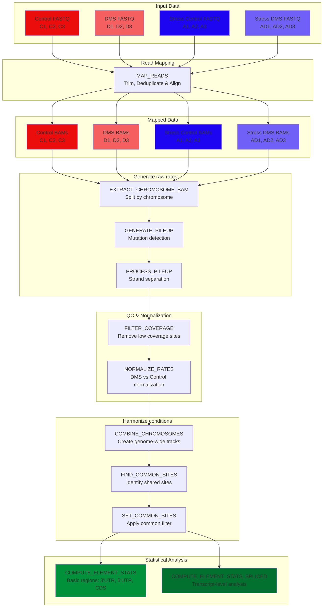

# TRAM-seq analysis pipeline

A nextflow pipeline for analyzing TRAM-seq (transcriptome-wide accessibility mapping by sequencing) data to quantify RNA structure and changes across different experimental conditions.

## Overview

This pipeline processes TRAM-seq sequencing data to:
- Map paired-end reads from FASTQ files to the reference genome
- Trim adapters and deduplicate reads for quality control
- Generate and process pileup files for mutation detection
- Filter coverage and normalize DMS modification rates
- Compute element-level statistics for genomic regions and transcripts

## Pipeline workflow

### Main processing flow


```mermaid
flowchart TD
    subgraph "Input Data"
        F1[Control FASTQ<br/>C1, C2, C3]
        F2[DMS FASTQ<br/>D1, D2, D3]
        F3[Stress Control FASTQ<br/>A1, A2, A3]
        F4[Stress DMS FASTQ<br/>AD1, AD2, AD3]
    end
    
    subgraph "Read Mapping"
        M[MAP_READS<br/>Trim, Deduplicate & Align]
    end

    subgraph "Mapped Data"
        A1[Control BAMs<br/>C1, C2, C3]
        A2[DMS BAMs<br/>D1, D2, D3]
        A3[Stress Control BAMs<br/>A1, A2, A3]
        A4[Stress DMS BAMs<br/>AD1, AD2, AD3]
    end
    
    subgraph "Generate raw rates"
        B[EXTRACT_CHROMOSOME_BAM<br/>Split by chromosome]
        C[GENERATE_PILEUP<br/>Mutation detection]
        D[PROCESS_PILEUP<br/>Strand separation]
    end
    
    subgraph "QC & Normalization"
        E[FILTER_COVERAGE<br/>Remove low coverage sites]
        F[NORMALIZE_RATES<br/>DMS vs Control normalization]
    end
    
    subgraph "Harmonize conditions"
        G[COMBINE_CHROMOSOMES<br/>Create genome-wide tracks]
        H[FIND_COMMON_SITES<br/>Identify shared sites]
        I[SET_COMMON_SITES<br/>Apply common filter]
    end
    
    subgraph "Statistical Analysis"
        J[COMPUTE_ELEMENT_STATS<br/>Basic regions: 3'UTR, 5'UTR, CDS]
        K[COMPUTE_ELEMENT_STATS_SPLICED<br/>Transcript-level analysis]
    end

    F1 & F2 & F3 & F4 --> M
    M --> A1 & A2 & A3 & A4
    A1 & A2 & A3 & A4 --> B
    B --> C
    C --> D
    D --> E
    E --> F
    F --> G
    G --> H
    H --> I
    I --> J
    I --> K

    style F1 fill:#EB0C0C
    style F2 fill:#F55F5F
    style F3 fill:#1D05F2
    style F4 fill:#7060F7
    style A1 fill:#EB0C0C
    style A2 fill:#F55F5F
    style A3 fill:#1D05F2
    style A4 fill:#7060F7
    style J fill:#01913B
    style K fill:#02702F
```

## Quick start
### Clone the repository.
```
git clone https://github.com/yourusername/dms-mapseq-pipeline.git
cd dms-mapseq-pipeline
```

### Set up reference genome files.
```
bash assets/genomes/download_chromosomes.sh
```

### Prepare ENSEMBL gene annotations.
```
bash assets/gtf/prepareGTF.sh
```

### Set up STAR index for mapping.
#### (This command may need to be modified to optimize for read-length used in sequencing library)
```
bash assets/STARindex/buildIndex.sh
```

### Install the BBMap suite of tools.
```
bash bbmap/downloadBBMap.sh
```

### Run the pipeline.
```
nextflow run main.nf -params-file params.yaml
```

## Requirements
### Software dependencies

nextflow (>=22.10.0)\
cutadapt (>=4.0)\
STAR (>=2.7.0)\
Java (>=11)\
samtools (>=1.15)\
bcftools\
bedtools\
python (>=3.7)

## Setup

### 1. Reference genome files

The pipeline requires individual chromosome FASTA files:
```
bash assets/genomes/downloadChromosomes.sh
```

### 2. BBMap suite

The pipeline uses BBMap tools for read deduplication:
```bash
bash bbmap/downloadBBMap.sh
```

### 3. STAR genome index

Build a STAR genome index for read alignment:
```bash
bash assets/STARindex/buildIndex.sh
```

Alternatively, specify the path to an existing STAR index in `params.yaml`:
```yaml
star_index: "/path/to/your/STAR/index"
```

### 4. Input data structure

#### Option A: Starting from FASTQ files (recommended)

Organize paired-end FASTQ files in the `data/fastq/` directory:

```
data/fastq/
├── C1s_R1.fastq.gz    # Control replicate 1, read 1
├── C1s_R2.fastq.gz    # Control replicate 1, read 2
├── D1s_R1.fastq.gz    # DMS replicate 1, read 1
├── D1s_R2.fastq.gz    # DMS replicate 1, read 2
├── A1s_R1.fastq.gz    # Stress control replicate 1, read 1
├── A1s_R2.fastq.gz    # Stress control replicate 1, read 2
├── AD1s_R1.fastq.gz   # Stress DMS replicate 1, read 1
└── AD1s_R2.fastq.gz   # Stress DMS replicate 1, read 2
```

The pipeline will automatically:
- Trim adapters and low-quality bases
- Remove PCR duplicates
- Align reads to the reference genome
- Filter for high-quality primary alignments
- Generate BAM files and QC reports

#### Option B: Starting from pre-existing BAM files

If you already have processed BAM files, you can skip the MAP_READS module by:
1. Placing BAM files in the expected location
2. Modifying the workflow to start from EXTRACT_CHROMOSOME_BAM

Note: Pre-existing BAMs should be:
- Sorted and indexed
- Filtered for primary alignments
- Mapped to the same reference genome used in the pipeline

