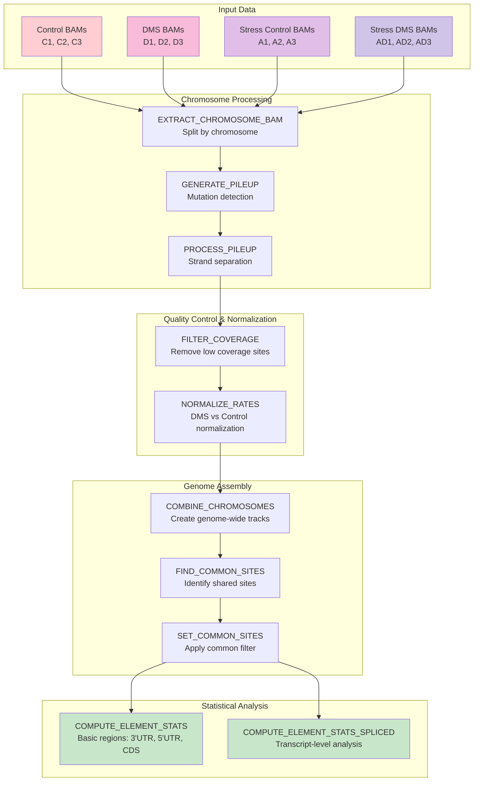

# TRAM-seq analysis pipeline

A nextflow pipeline for analyzing TRAM-seq (transcriptome-wide accessibility mapping by sequencing) data to quantify RNA structure and changes across different experimental conditions.

## Overview

This pipeline processes TRAM-seq sequencing data to:
- Generate and process pileup files for mutation detection
- Filter coverage and normalize DMS modification rates
- Compute element-level statistics for genomic regions and transcripts

## Pipeline workflow

### Main processing flow



## Quick start
### Clone the repository
```
git clone https://github.com/whitehead/TRAM-seq.git
cd TRAM-seq
```

### Set up reference genome files
```
bash assets/genomes/download_chromosomes.sh
```

### Run the pipeline
```
nextflow run main.nf -params-file params.yaml
```

## Requirements
### Software dependencies

nextflow (>=22.10.0)\
Java (>=11)\
samtools\
bcftools\
bedtools\
python (>=3.7)

## Setup

### 1. Reference genome files

The pipeline requires individual chromosome FASTA files:
```
bash assets/genomes/download_chromosomes.sh
```

### 2. Input data structure

Organize your BAM files in the data directory.
